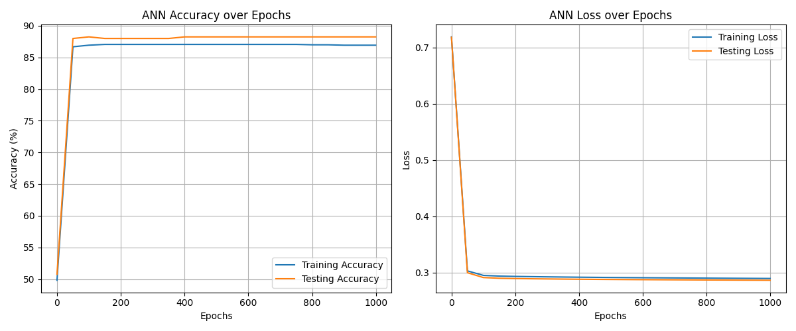

## Overview
This script implements a simple 2-layer Artificial Neural Network (ANN) from scratch using NumPy. It trains a feedforward network with a single hidden layer (sigmoid activations) for binary classification and logs training/testing accuracy and loss during training. After training it visualizes learning curves using a helper plotting function.

Key features:
- Manual forward pass and backpropagation with sigmoid activations
- Binary cross-entropy loss
- Bias terms for hidden and output layers
- Metric tracking (accuracy and loss) for training and testing sets
- Visualization via `visualize_learning_curves`


## return from dataset_setup()
The `dataset_setup()` function is expected to return the following in order:
- X_train: array, shape (n_train_samples, input_nodes)
- y_train: array, shape (n_train_samples, output_nodes) or (n_train_samples,) for single-output
- X_test: array, shape (n_test_samples, input_nodes)
- y_test: array, shape (n_test_samples, output_nodes) or (n_test_samples,)
- input_nodes: int
- hidden_nodes: int
- output_nodes: int (for binary classification this is typically 1)
- W1: numpy array, initial weights from input -> hidden, shape (input_nodes, hidden_nodes)
- W2: numpy array, initial weights from hidden -> output, shape (hidden_nodes, output_nodes)

Make sure `y_train` and `y_test` contain binary labels (0/1) compatible with the final sigmoid output.

## How to run
From the repository root:
```
python dl/ANN/ann.py
```

The script will:
1. Initialize biases and use weights returned by `dataset_setup`.
2. Train for `epochs` iterations (default 1000).
3. Print progress every 50 epochs (and on the last epoch).
4. Plot learning curves at the end using `visualize_learning_curves`.

You can modify hyperparameters directly in the file:
- `lr` — learning rate (default 0.01)
- `epochs` — number of training iterations (default 1000)

## Implementation notes
- Activation: sigmoid(x) = 1 / (1 + exp(-x))
- Sigmoid derivative used in backprop: sigmoid_output * (1 - sigmoid_output)
- Loss: binary cross-entropy (with small epsilon clipping for numerical stability)
- Predictions: thresholded at 0.5 to compute accuracy
- Weight updates use a basic gradient step (no momentum, no regularization)
- Biases b1 and b2 are initialized randomly with shape (1, hidden_nodes) and (1, output_nodes)

## Common issues & troubleshooting
- Shape mismatches:
  - Ensure W1 and W2 shapes align with X and hidden/output sizes.
  - If `y` is shape (n_samples,), you may need to reshape to (n_samples, 1) depending on how `dataset_setup` provides labels.
- Non-converging training:
  - Try reducing the learning rate, increasing hidden nodes, normalizing input features, or increasing epochs.
- Numerical instability / overflow in exp:
  - Large inputs to sigmoid can cause warnings. Normalize inputs or initialize weights with smaller magnitudes.
- Incorrect accuracy:
  - Verify labels are exactly 0 or 1 (integers) and not floats very close to 0/1 or categorical strings.

## Customization ideas
- Replace sigmoid with ReLU in hidden layer and sigmoid in output for binary classification.
- Add weight initialization control (seed, Xavier/He initialization).
- Track and save model parameters (W1, W2, b1, b2) periodically.
- Add regularization (L2) or an optimizer (SGD with momentum, Adam).
- Support multi-class classification by using softmax + categorical cross-entropy.

## Outputs
- Console logs: epoch summaries showing training and testing accuracy and loss.
- Plot: learning curves showing training vs testing accuracy and loss (via `visualize_learning_curves`).

## Test Result Visualization
