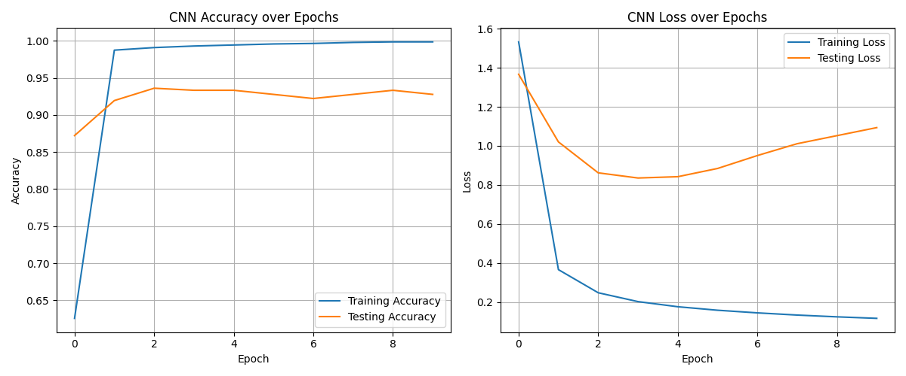

A small educational repository implementing basic machine learning and deep learning algorithms from scratch in NumPy. This project contains a minimal Convolutional Neural Network (CNN) training example (no deep frameworks) intended for learning and experimentation.

## Contents / Project structure (important files)
- dl/CNN/trainer.py — Simple end-to-end CNN training script (Conv → ReLU → Flatten → Dense).
- dl/CNN/cnn.py — Convolutional layer, flatten layer, softmax, and loss implementations (used by trainer).
- dl/CNN/datasetup.py — Provides `X_data`, `y_data`, `one_hot`, `X_test`, `y_test` (simple dataset loader / generator).
- dl/CNN/graph.py — Helpers to visualize learning curves.
- Other scripts and notebooks demonstrating algorithms implemented from scratch.

> Note: The trainer referenced in this README is at dl/CNN/trainer.py (commit d7d6a7ce...).


## Quick start — run the CNN trainer
From the repository root run:
```bash
python dl/CNN/trainer.py
```

What the script does:
- Initializes a ConvLayer and FlattenLayer and a small dense weight matrix.
- Runs a small training loop for a configurable number of epochs (default 10).
- Uses forward propagation (Conv → ReLU → Flatten → Dense → Softmax), cross-entropy loss, and a simple backward pass to update convolutional kernels and dense weights.
- Computes train/test loss and accuracy each epoch and plots learning curves using `visualize_learning_curves`.

Make sure you have the dataset variables (`X_data`, `y_data`, `X_test`, `y_test`) prepared by `datasetup.py`. The trainer expects:
- Images shaped like 8×8 (see datasetup for exact shapes; trainer uses a 3×3 convolution producing 6×6 feature maps).
- Labels as integers 0–9 (one-hot conversion done inside the trainer via `one_hot`).

## Key hyperparameters and how to change them
- Learning rate: change `lr` passed to `train_step` (default 0.01).
- Epochs: change `epochs` at the top of the training loop (default 10).
- Conv kernel size: change when creating `ConvLayer(kernel_size=3)` in trainer.
- Dense initialization: `dense_weights = np.random.randn(36, 10) * 0.1` — adjust to match number of features / classes.

## Implementation notes
- The trainer uses a minimalist manual backward pass:
  - Error is computed as `probs - label_one_hot` (dL/dlogits).
  - Gradient for dense layer: dot(out_flat.T, error).
  - Backpropagates through flatten and ReLU into conv layer and updates conv kernels via `conv.backward(grad_conv, lr)`.
- The code is intentionally simple and educational — it is not optimized for performance or numerical stability.

## Troubleshooting
- If you get shape mismatch errors, inspect `datasetup.py` to confirm the image size and number of classes match the trainer's expectations.
- If plotting fails, ensure Matplotlib is installed and that a display backend is available (on headless servers, use Agg backend: `export MPLBACKEND=Agg` before running, or save plots instead of showing them).

## Extending / Contributing
- Replace random dataset in `datasetup.py` with real data (e.g., small MNIST subset).
- Add training features: batching, momentum, weight decay, multi-layer dense heads.
- Improve numerical stability for softmax/cross-entropy.
- Add unit tests for layer forward/backward implementations.


## Test Result Visualization
