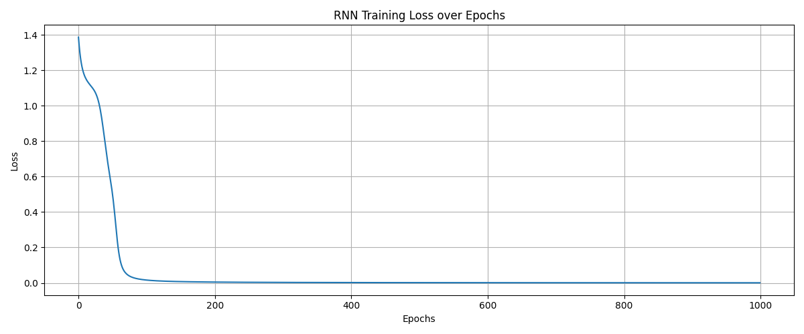

## Overview
This script implements a simple Recurrent Neural Network (RNN) from scratch using NumPy. It trains a character-level language model to predict the next character in a sequence. The RNN uses tanh activations and is trained with backpropagation through time (BPTT) for sequence prediction.

Key features:
- Manual forward pass and backpropagation through time
- Character-level sequence prediction
- Softmax output for probability distribution over vocabulary
- Cross-entropy loss
- Metric tracking (accuracy and loss) during training
- Visualization of learning curves

## Dataset
The dataset is a simple character sequence:
- Input: "hell"
- Target: "ello"
- Vocabulary: ['h', 'e', 'l', 'o'] (4 characters)

The `datasetup.py` provides:
- `inputs`: List of one-hot encoded input vectors
- `target_indices`: List of target character indices
- `vocab_size`: Size of vocabulary (4)
- `ix_to_char`: Dictionary mapping indices to characters

## How to run
From the repository root:
```
python dl/RNN/trainer.py
```

The script will:
1. Initialize the RNN with vocab_size=4 and hidden_size=10
2. Train for 1000 epochs
3. Print progress every 100 epochs (and on the last epoch)
4. Plot learning curves at the end using `visualizing_learning_curves`

You can modify hyperparameters directly in `trainer.py`:
- `hidden_size` — number of hidden units (default 10)
- `epochs` — number of training iterations (default 1000)
- `lr` — learning rate in backward pass (default 0.1)

## Implementation notes
- Activation: tanh(x) = (exp(x) - exp(-x)) / (exp(x) + exp(-x))
- Tanh derivative used in backprop: 1 - tanh_output²
- Loss: cross-entropy with numerical stability (clipping predictions)
- Predictions: argmax of softmax probabilities
- Weight updates use gradient descent with gradient clipping to prevent exploding gradients
- Hidden state is maintained across time steps for sequence memory

## RNN Architecture
- Input → Hidden: Wxh (hidden_size × vocab_size)
- Hidden → Hidden: Whh (hidden_size × hidden_size)
- Hidden → Output: Why (vocab_size × hidden_size)
- Biases: bh (hidden_size × 1), by (vocab_size × 1)

## Common issues & troubleshooting
- If training doesn't converge, try adjusting the learning rate or hidden size
- Gradient clipping is applied to prevent exploding gradients
- The model is intentionally simple for educational purposes

## Test Result Visualization
